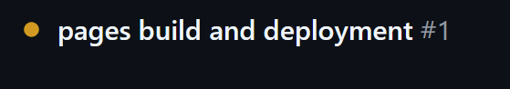

# PacMan(Twist)

A browser based arcade-like game built for the **Hack Club YSWS Twist event**.

This version of the game takes the orignal game and adds a gravity mechanic. Every 30 seconds, the game cycles between the orignal classic mode and the Twist mode, where the map rotates using the arrow keys instead of the pacman sprite and the pacman sprite falls due to gravity.

## Controls
- **Spacebar:** Start the game and restart after Game Over.
- **Arrow keys (Phase-1):** Move up, down, left and right.
- **Arrow keys (Phase-2):** Rotate the entire maze to guide the pacman with gravity.

## What I used to build this
- **HTML:** Structure of the game.
- **CSS:** Styling
- **JS:** Main game logic
- **Older Pacman game that i had made:** For reference
- **Claude and Gemini:** For fixing the many bugs that came up, for the audio and for desiging the maze layout.

## Challenges I had faced
- **Git:** Did some mistake using git and messed up rebase so badly that i had to remove the repo and make a new one.
- **Pacman Animation:** I couldnt make the logic on my own and had to use both Claude and Gemini back and forth to fix that as they kept hallucinating.
- **Tying Animation to velocity:** I wanted to have it so that when the pacman stops moving, the animation stops but i couldnt implement this by myself.
- **Github Pages just wont deploy:** It was literally stuck on  for so long and i had to deploy it using github actions instead.
- **Gravity logic:** Was able to visualise the logic easily but after writing it, the pacman would keep shooting through the entire map and start teleporting. Had to consult ai and cap the speed and use friction for that.
- **Pacman Animation in phase-2:** Its almost fully broken; it doesnt face the direction its going in and starts having a glitchy/stuttery animation when it sticks to a wall lol.
- **Redundant curly braces that kept popping up:** Had to disable Autocomplete to stop this lol as i press tab when the dropdown shows up while typing the function names.
-- **Friction dependancy on framerate:** New concept for me that at 30fps friction is weaker than at 120fps.

---

## Future Plans(Things i wanna add)
- Fixing Phase 2 Animations
- Adding some background music
- Changing the background music based on the phase of the game
- Separate logics for all three ghosts as in the og game
- Warning before phase change maybe
- Pause feature